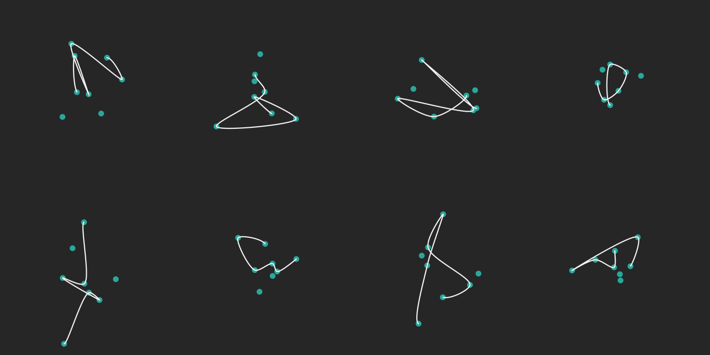

# ruspline



Needed things
---
*   [Nix](https://nixos.org/nix/)

Quick start
---
```
$ ./shell
[nix-shell:path/to/ruspline]$ cd dev/
[nix-shell:path/to/ruspline/dev]$ nightrun
target/release/main ALPHA TENSION N_POINTS SEED WIDTH HEIGHT TILE_SIZE FILENAME
  ALPHA     : float  [0.0,1.0]
  TENSION   : float  [0.0,1.0]
  N_POINTS  : int    [4,2^8 - 1]
  SEED      : int    [0,2^64 - 1]
  WIDTH     : int    [1,2^16 - 1]
  HEIGHT    : int    [1,2^16 - 1]
  TILE_SIZE : int    [1,2^16 - 1]
  FILENAME  : string
[nix-shell:path/to/ruspline/dev]$ nightrun 0.5 0.1 8 0 4 2 350 ../out/main.png
[nix-shell:path/to/ruspline/dev]$ open ../out/main.png
```
